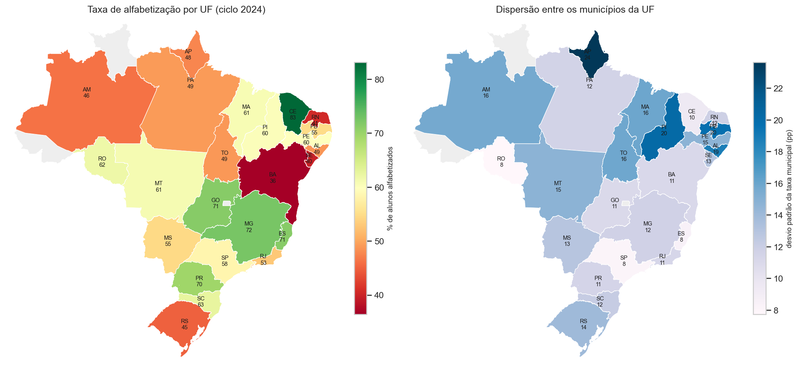
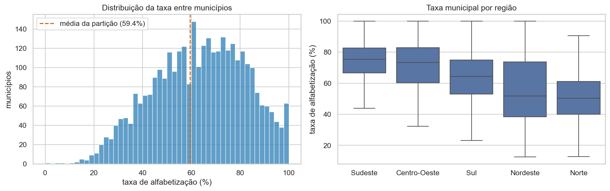
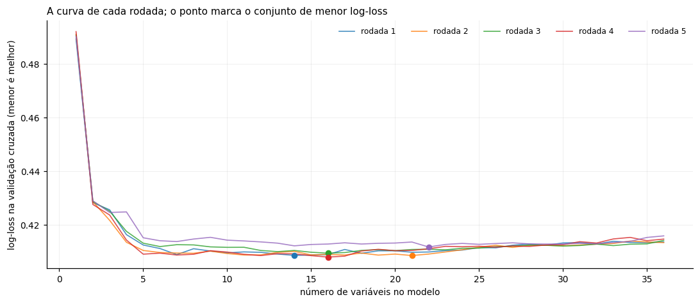
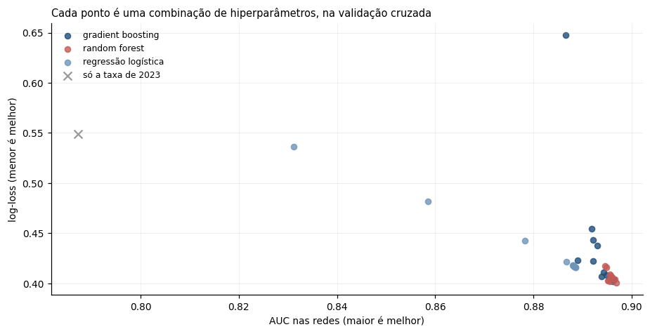
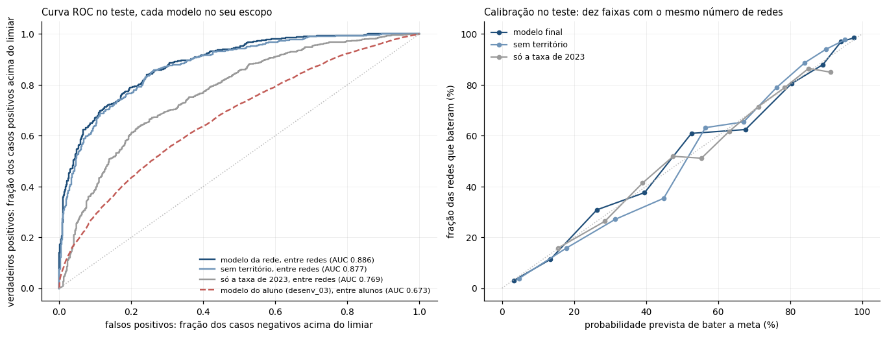
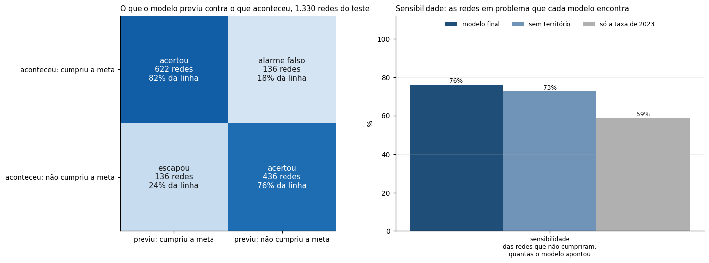
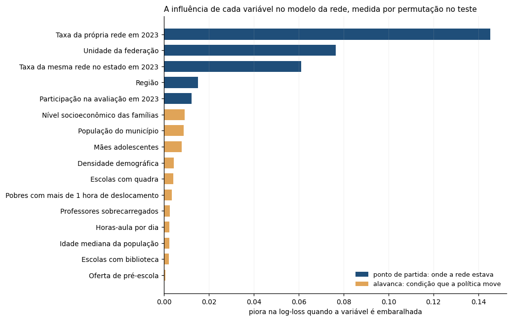
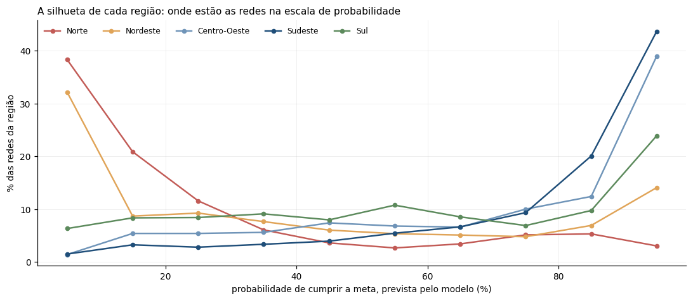
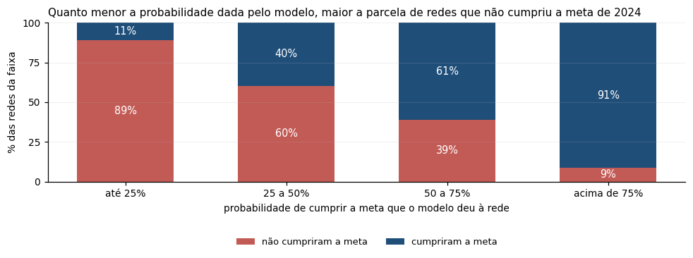
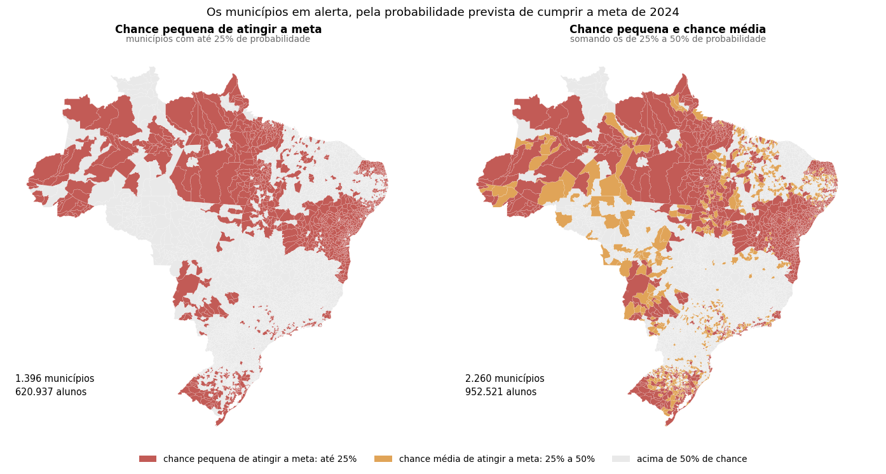

# Predição e Inteligência Analítica para a Alfabetização no Brasil

Modelo supervisionado de machine learning para prever o cumprimento da meta de alfabetização no 2º ano do ensino fundamental, construído sobre o data lake desenvolvido na Fase 2, com interpretabilidade e aplicação a políticas públicas educacionais.

> Tech Challenge da Fase 3 (Machine Learning) · Pós-graduação IA para Devs · FIAP POS TECH

---

## Sumário

1. [Contexto do problema](#1-contexto-do-problema)
2. [Objetivo analítico](#2-objetivo-analítico)
3. [Base de dados](#3-base-de-dados)
4. [Premissas e ressalvas](#4-premissas-e-ressalvas)
5. [Análise exploratória](#5-análise-exploratória)
6. [Etapas de modelagem](#6-etapas-de-modelagem)
7. [Escolha do algoritmo](#7-escolha-do-algoritmo)
8. [Métricas de avaliação](#8-métricas-de-avaliação)
9. [Interpretação dos resultados](#9-interpretação-dos-resultados)
10. [Insights encontrados](#10-insights-encontrados)
11. [Limitações do projeto](#11-limitações-do-projeto)
12. [Aplicação prática para políticas públicas](#12-aplicação-prática-para-políticas-públicas)
13. [Evoluções futuras](#13-evoluções-futuras)
14. [Como executar](#14-como-executar)
15. [Estrutura do repositório](#15-estrutura-do-repositório)

---

## 1. Contexto do problema

A alfabetização na idade certa é um dos fundamentos do desenvolvimento educacional e social do país, e o **Indicador Criança Alfabetizada** (INEP) acompanha o percentual de crianças alfabetizadas até o final do 2º ano do ensino fundamental, com o critério de proficiência mínima de 743 pontos na escala Saeb.

Compreender apenas os dados já observados, porém, não basta para apoiar decisões. Gestores públicos precisam **antecipar riscos**, identificar territórios vulneráveis e saber **quais fatores pesam mais** sobre o resultado educacional, para direcionar recursos antes que o ciclo se encerre. É desse deslocamento, do dado descritivo para a inteligência preditiva, que este projeto trata.

O contexto completo do indicador, seus impactos e a metodologia de cálculo estão documentados na [fase anterior deste trabalho](https://github.com/pedrohm1986b/Tech_Challenge_RM373453_pipeline_alfabetizacao).

## 2. Objetivo analítico

Desenvolver um **modelo supervisionado de classificação** que antecipe o resultado da alfabetização a partir de variáveis educacionais, territoriais e socioeconômicas, com três exigências que orientam todo o desenho:

- **Pipeline reproduzível:** pré-processamento integrado ao modelo, com tratamento explícito de valores faltantes, codificação de categóricas e prevenção de vazamento de dados (*data leakage*);
- **Interpretabilidade:** identificar quais variáveis mais influenciam a predição, com **importância por permutação** e **dependência parcial**, que dão direção e tamanho do efeito sem depender de biblioteca adicional;
- **Aplicação estratégica:** responder às perguntas de negócio do enunciado, e não apenas maximizar métricas.

O projeto foi desenvolvido em duas rodadas de modelagem. A primeira previu **o aluno**, como pede a leitura literal do enunciado, e mediu o próprio limite. A segunda previu a **rede de ensino de cada município**, que é a unidade em que as variáveis disponíveis efetivamente discriminam e em que a decisão de política acontece. A seção 3.3 explica a passagem de uma para a outra, e o modelo da rede é a entrega principal deste trabalho.

## 3. Base de dados

A base provém do **data lake construído na Fase 2** deste Tech Challenge, alimentado pelo dataset público *Avaliação da Alfabetização* (INEP, via Base dos Dados) e pelo diretório de municípios do IBGE, organizado em Arquitetura Medalhão. Cada camada do lake tem um grão e um propósito próprios, e a escolha de qual delas sustenta a modelagem é a primeira decisão do projeto.

### 3.1 A linha e o contexto

O objetivo analítico exige uma linha por unidade a prever. As duas camadas disponíveis respondem a perguntas diferentes:

| Camada | Grão | Volume | Natureza |
|---|---|---:|---|
| **Silver** | aluno avaliado | 3.866.814 linhas | dados curados no grão do fato |
| **Gold** | município × ano | 11.629 linhas | produto de dados agregado, pronto para consumo |

A camada Gold foi construída como **produto de dados**: sua taxa de alfabetização é a média ponderada `Σ(peso × alfabetizado) / Σ(peso)` por município e ano, modelada para consulta, painéis e comparação com metas. Ela responde *"como está o município"*. A camada Silver preserva o registro individual e responde *"o que aconteceu com cada aluno"*.

Três razões sustentam a escolha da Silver como base da tabela analítica:

1. **A agregação é irreversível.** A taxa municipal é a média daquilo que se quer explicar: a variação entre alunos da mesma rede e do mesmo município foi dissolvida nela e não pode ser recuperada;
2. **A arquitetura medalhão prevê esse uso.** A Silver é a camada limpa, validada e integrada, indicada para engenharia de atributos e machine learning; a Gold é a camada agregada, destinada ao consumo analítico;
3. **Evitar vazamento de dados exige separar os papéis.** A taxa municipal de um ano é calculada com os próprios alunos daquele ano. Usá-la como variável explicativa de um desses alunos entregaria a resposta ao modelo pela porta dos fundos.

A Gold não fica de fora: ela muda de papel e fornece o contexto territorial, sempre **defasado em relação ao ciclo do aluno**, o que também neutraliza o vazamento descrito acima. O registro completo dessa decisão está na **D-001** do [diário de decisões](docs/decisoes.md).

### 3.2 O enriquecimento: o lake entrega o resultado, não as causas

O data lake da Fase 2 foi construído para **medir** o indicador, e cumpre isso bem. O que ele traz, porém, é quase só a resposta e a identificação de quem respondeu:

| O que o lake já tinha | Grão |
|---|---|
| presença, proficiência, condição de alfabetizado e peso amostral | aluno |
| rede de ensino, município, ano e porte | aluno |
| taxa de alfabetização, participação, meta pactuada e distância até ela | município × ano |

Um modelo alimentado só com isso teria **uma única variável explicativa de verdade**: a taxa do ano anterior. Ele previria o futuro repetindo o passado, sem nada que explicasse *por que* uma rede vai bem ou mal, e sem nenhuma variável sobre a qual um gestor possa agir. O indicador estaria descrito, e a pergunta do enunciado continuaria sem resposta.

Daí a etapa de **enriquecimento**: sete fontes públicas externas foram incorporadas à tabela analítica, escolhidas a partir das hipóteses declaradas em [`docs/hipoteses.md`](docs/hipoteses.md), e não por disponibilidade (**D-005** e **D-006**).

| Fonte | O que acrescenta | Hipótese que sustenta |
|---|---|---|
| **INEP, Censo Escolar** | infraestrutura das escolas: biblioteca, quadra, água, energia, alimentação, internet, além de porte e ruralidade | a escola oferece, ou não, as condições materiais da alfabetização |
| **INEP, Indicadores Educacionais** | esforço docente, formação adequada, regularidade e horas-aula diárias | o corpo docente e o tempo de aula influenciam o aprendizado |
| **INEP, INSE** | nível socioeconômico médio das famílias atendidas pela rede | a família é parte do processo de alfabetização |
| **IBGE, Censo Demográfico 2022** | densidade, idade mediana, saneamento e alfabetização adulta | o território condiciona o acesso e o repertório da criança |
| **IBGE, PIB municipal e estimativa populacional** | porte econômico, perfil produtivo e população | a capacidade fiscal e a escala da rede afetam a gestão |
| **PNUD, Atlas do Desenvolvimento Humano** | IDHM, renda, Gini, expectativa de estudo e deslocamento longo | a desigualdade acumulada aparece antes da escola |
| **Ministério da Saúde, SINASC e DataSUS** | gravidez na adolescência, escolaridade materna e mortalidade violenta | o contexto familiar e a violência cercam a trajetória escolar |

O enriquecimento é também o que torna possível a resposta de política: sem ele, a seção 10 não teria nada a dizer além de "quem estava mal continua mal". Todas essas fontes, porém, têm grão de **escola, rede ou município**, e nenhuma descreve a criança. Essa característica define a etapa seguinte.

> 📓 **Para o detalhe:** a integração das fontes, com o ano de referência e o tratamento de cada uma, está no [`desenv_01`](notebooks/desenv_01_base_analitica.ipynb); o inventário completo das variáveis, em [`reports/dicionario_dados.csv`](reports/dicionario_dados.csv), e as hipóteses que guiaram a escolha, em [`docs/hipoteses.md`](docs/hipoteses.md).

### 3.3 Do aluno para a rede: por que a estratégia mudou

**A primeira rodada foi literal.** O enunciado pede prever a alfabetização do aluno, e foi o que o `desenv_03` fez: uma linha por criança, com todo o contexto disponível. O resultado expôs um problema que não era de algoritmo, e sim de dados: **dois alunos da mesma rede, no mesmo município, chegam ao modelo com exatamente os mesmos valores em todas as variáveis**, e ainda assim um é alfabetizado e o outro não. Nenhuma variável separa duas crianças de uma mesma sala.

A consequência é mensurável. Cerca de **90% da variação do resultado está dentro da rede**, justamente onde as variáveis não discriminam, o que impõe um teto à tarefa: a maior AUC alcançável com essa informação é **0,701**. O modelo chegou a 0,673, perto do próprio teto, mas quase colado na referência sem modelo, que faz 0,643. O ganho de **+0,030** não sustenta uma decisão de política.

**A segunda rodada abstraiu o problema.** Se as variáveis descrevem a rede, é a rede que elas conseguem prever. O `desenv_04` mudou a unidade prevista para a **rede de ensino de cada município**, alinhando três coisas que estavam desencontradas: o grão das variáveis, o grão da resposta e o grão em que a política é decidida. Um secretário não decide sobre a criança X: ele decide sobre a rede.

| na partição de teste | modelo do aluno (`desenv_03`) | modelo da rede (`desenv_04`) |
|---|---|---|
| a pergunta | o aluno será alfabetizado? | a rede cumprirá a meta de 2024? |
| AUC | 0,673 | **0,886** |
| AUC da referência sem modelo | 0,643 | 0,769 |
| **ganho sobre a referência** | **+0,030** | **+0,117** |
| limite da tarefa | 0,701, a AUC máxima possível | sem limite estrutural |

As duas AUCs não se comparam como número, porque as tarefas são diferentes. O que elas mostram é **onde os dados têm informação**: no grão do aluno o modelo mal se descola de repetir o ano anterior e não tem para onde crescer; no grão da rede ele se distancia da referência com folga e ainda tem espaço. O modelo do aluno permanece no repositório, com o seu limite medido, e o modelo da rede é o que serve para decidir (**D-012** e **D-013**).

> 📓 **Para o detalhe:** a medição do teto e o modelo do aluno estão no [`desenv_03`](notebooks/desenv_03_pipeline_modelagem.ipynb); a construção do modelo da rede, no [`desenv_04`](notebooks/desenv_04_pipeline_modelagem_parte2.ipynb), cujo parecer final compara as duas rodadas lado a lado.

### 3.4 A unidade final de análise

A **rede-município** é o conjunto de escolas da rede municipal, ou da rede estadual, dentro de um mesmo município. Não é a rede municipal ou a estadual do país inteiro: a rede municipal de Sorocaba e a rede estadual em Sorocaba são duas unidades diferentes, cada uma com a sua taxa e a sua previsão.

| | |
|---|---:|
| redes-município | 6.535 |
| municípios | 5.570 |
| alunos de 2024 representados | 1.851.828 |
| variável resposta | taxa ponderada de 2024 ≥ 59,9% (meta pactuada) |

## 4. Premissas e ressalvas

- **A população modelada são os alunos presentes na avaliação.** Alunos ausentes não têm proficiência registrada e, portanto, não têm variável resposta observável. A não participação fica fora do escopo preditivo e permanece registrada como limitação;
- **A taxa de cada rede usa o peso amostral do INEP,** o mesmo cálculo da taxa oficial, para que o alvo do modelo seja comparável ao indicador publicado;
- **A rede privada fica fora da modelagem** (**D-011**): a meta pactuada é da rede pública, e é sobre ela que a política incide;
- **A meta é a de 2024, de 59,9%,** pactuada no Compromisso Nacional Criança Alfabetizada. O país fechou o ano em 59,2%, logo abaixo dela;
- **A partição é por município,** e não por rede: as duas redes de um mesmo município caem sempre do mesmo lado, para que nenhuma informação do treino chegue ao teste pela vizinhança;
- **O contexto entra defasado.** O modelo prevê 2024 com informação de 2023 e anterior, de modo que a previsão seria possível antes de o resultado sair;
- **O ciclo modelado é 2024, e não 2025.** O resultado nacional de 2025 já foi divulgado, em 66,0%, mas apenas no agregado: **não existe taxa observada por município e rede para 2025** nas bases públicas. Na [fase anterior](https://github.com/pedrohm1986b/Tech_Challenge_RM373453_pipeline_alfabetizacao), o ciclo de 2025 aparece como estimativa preliminar, construída a partir de eventos simulados para exercitar a ingestão em fluxo, e declarada como tal. Um modelo supervisionado precisa de resposta observada no grão que prevê, e o único par disponível com resposta real é **contexto de 2023 e resultado de 2024**. Há ainda uma segunda razão, de alinhamento temporal: as fontes que enriquecem a base são de 2021 a 2023, e algumas mais antigas, de modo que 2024 é o ciclo em que explicação e resposta ficam mais próximas no tempo. Prever 2025 acrescentaria um ano de defasagem a **todas** as variáveis explicativas de uma vez. Aplicar o modelo às condições de 2024 para projetar 2025 continua possível e está registrado em evoluções futuras, mas seria uma previsão sem acerto medível até o INEP publicar o resultado municipal daquele ciclo.

## 5. Análise exploratória

A exploração (`desenv_02`) trabalhou o indicador no grão do município e do aluno, e produziu as hipóteses declaradas em [`docs/hipoteses.md`](docs/hipoteses.md), que guiaram o enriquecimento da base.



A exploração (`desenv_02`) não foi um inventário de gráficos: foi uma **cadeia de perguntas**, em que cada resposta determinou a seguinte e, no fim, o desenho da modelagem.

**Dá para distinguir duas crianças?** Não. Apenas 9,4% da variação do resultado individual está entre municípios; os outros **90,6% acontecem entre alunos do mesmo município**, e nenhuma variável desta base alcança essa diferença. O teto da tarefa já estava ali, esperando para ser medido.

**Então como ler a resposta?** O corte de 743 pontos na escala Saeb cai sobre a região mais densa das notas: **32,4% dos alunos ficam a menos de 20 pontos dele**. Perto da linha, um erro pequeno troca o lado, e foi daí que veio a decisão de ler o modelo por probabilidade, e não por acurácia.

**Se não é o aluno, o que tem sinal?** O território. A amplitude entre UFs chega a **49,3 pontos**, de 36,0% na Bahia a 85,3% no Ceará, e dentro do estado as cidades grandes puxam o resultado para baixo: a capital paulista, com 94 mil alunos, alfabetiza 56,6%, menos que 7 em cada 10 municípios paulistas. A unidade que carrega sinal é a rede dentro do município.

**E o que explica o território?** Ele mesmo, no ano anterior: a correlação entre as taxas municipais de 2023 e 2024 é de **0,665**. A exceção confirma a leitura: o Rio Grande do Sul cai 18,8 pontos em 2024, o ano das enchentes. Por isso a inércia entrou como referência a superar, e não como alavanca de política.

**O que sobra para a política?** Entre os fatores que um gestor move, a **oferta de pré-escola** se destaca, separando os alunos em 18,9 pontos entre o primeiro e o último quintil, bem à frente dos demais.

Cada variável entrou com **hipótese declarada antes da medição**, com a direção esperada: sem isso, qualquer resultado vira confirmação. Das treze hipóteses, quatro se confirmaram, quatro em parte e três ficaram fracas ou não confirmadas.



## 6. Etapas de modelagem

| Etapa | Notebook | Entrega |
|---|---|---|
| Base analítica | `desenv_01` | tabela de modelagem com a Silver, o contexto da Gold defasado e as travas contra vazamento |
| Análise exploratória | `desenv_02` | distribuições, associações e hipóteses declaradas |
| Enriquecimento | `desenv_01` | sete fontes públicas externas, no grão do município e da escola |
| Pipeline e primeira rodada | `desenv_03` | pré-processamento integrado, modelo no grão do aluno e o teto da tarefa |
| Segunda rodada | `desenv_04` | curadoria das variáveis, três famílias comparadas e avaliação no teste |
| Aplicação estratégica | `desenv_05` | as cinco perguntas de negócio, sobre o modelo pronto |

**O pipeline.** Todo o pré-processamento vive dentro do `Pipeline` do Scikit-learn e é aprendido só no treino: indicadores de ausência criados antes da imputação, imputação pela mediana da UF com recurso à mediana nacional, codificação one-hot das categóricas e, nos modelos lineares, logaritmo e padronização. Assim, nenhuma estatística do teste influencia o que o modelo aprende (**D-011**).

**A curadoria das variáveis.** As 41 variáveis herdadas da primeira rodada passaram por dois filtros objetivos, calculados apenas no treino (**D-015**):



- **Etapa A, sem olhar a resposta.** Saem variáveis com mais de 20% de ausentes, com 90% ou mais de repetição do mesmo valor, com VIF acima de 10 ou com correlação de Spearman acima de 0,8 com outra da base. Restaram 36;
- **Etapa B, com seleção por estabilidade.** Eliminação regressiva por permutação da log-loss, repetida em cinco rodadas com divisões diferentes do treino. Entrou quem ficou no melhor conjunto em pelo menos quatro das cinco. Restaram **14**;
- **UF e região entram fora da seleção,** como ponto de partida de cada rede, pela mesma razão da taxa do ano anterior: são informação que não muda de 2023 para 2024 e descrevem de onde a rede parte.

O modelo final usa **16 variáveis**: 14 selecionadas mais UF e região. Com elas, prevê melhor do que com as 41 herdadas (0,886 contra 0,877 de AUC no teste) e fica explicável.

> 📓 **Para o detalhe:** a curadoria completa, com os números de cada filtro e as cinco rodadas da seleção por estabilidade, está na seção 2 do [`desenv_04`](notebooks/desenv_04_pipeline_modelagem_parte2.ipynb); o resultado variável a variável, em [`reports/curadoria_variaveis.csv`](reports/curadoria_variaveis.csv).

## 7. Escolha do algoritmo

Três famílias foram comparadas com validação cruzada por município, com o critério declarado **antes** de rodar: vence a maior AUC; empate técnico abaixo de 0,005 é resolvido pela log-loss; persistindo o empate, escolhe-se o modelo mais simples.



| Família | AUC (validação cruzada) | Log-loss |
|---|---|---|
| **Random Forest** | **0,8968** | **0,4009** |
| Gradient Boosting | 0,8962 | 0,4023 |
| Regressão Logística | 0,8886 | 0,4159 |

A **Random Forest** venceu, praticamente empatada com o gradient boosting, e foi treinada com `n_estimators=400`, `max_depth=12`, `min_samples_leaf=5`, `max_features=0.3` e semente fixa. A receita completa está registrada em [`reports/modelo_rede_escolhido.json`](reports/modelo_rede_escolhido.json), e é ela que o `desenv_05` recarrega, com uma trava que confere se a AUC reproduzida bate com a registrada.

> 📓 **Para o detalhe:** a busca de hiperparâmetros e a comparação das três famílias estão na seção 3 do [`desenv_04`](notebooks/desenv_04_pipeline_modelagem_parte2.ipynb); a grade testada, em [`reports/busca_hiperparametros_rede.csv`](reports/busca_hiperparametros_rede.csv).

## 8. Métricas de avaliação

### 8.1 A referência: repetir 2023

Um modelo não se avalia contra a perfeição, e sim contra **o que seria feito sem ele**. Aqui essa alternativa tem nome e número: supor que cada rede repete a situação do ano anterior. Na prática, é uma regressão logística com uma única variável, a taxa da rede em 2023, e a leitura é direta: quanto melhor a rede estava, maior a chance de cumprir a meta no ano seguinte.

É uma referência exigente, e é por isso que ela foi adotada. A taxa de um ano explica boa parte da taxa do ano seguinte, de modo que qualquer modelo parte de um patamar já alto: **um modelo que não supera a referência não acrescenta informação nenhuma, apenas repete o passado com mais passos**. O mesmo critério foi aplicado nas duas rodadas, o que permitiu comparar estratégias que de outro modo seriam incomparáveis:

| ganho sobre repetir 2023, no teste | AUC do modelo | AUC da referência | ganho |
|---|---|---|---|
| modelo do aluno (`desenv_03`) | 0,673 | 0,643 | **+0,030** |
| modelo da rede (`desenv_04`) | 0,886 | 0,769 | **+0,117** |

O ganho de 0,030 no grão do aluno foi o sinal que motivou a revisão de escopo descrita na seção 3.3: o modelo funcionava, mas entregava pouco mais do que a regra trivial, e num problema com teto de 0,701 não havia para onde melhorar.

### 8.2 Por que AUC e sensibilidade, e não acurácia

A meta de 59,9% fica praticamente em cima da média do país, e 18% das redes terminam o ano a menos de cinco pontos dela. Nessa faixa, um erro pequeno de previsão troca o lado da classificação, e a acurácia passa a medir a sorte na fronteira, e não a qualidade do modelo. Por isso o modelo é lido por dois prismas: a **AUC**, que mede a ordenação sem depender de limiar, e a **sensibilidade**, que mede quantas redes em problema o modelo encontra, que é o que importa para quem precisa agir.



| no teste, 1.330 redes de 1.104 municípios nunca vistos | modelo final | repetir 2023 |
|---|---|---|
| AUC | **0,886** | 0,769 |
| log-loss (menor é melhor) | **0,417** | 0,569 |
| sensibilidade: das redes que não cumpriram, quantas foram apontadas | **76,2%** | 58,7% |
| maior erro de calibração numa faixa | 8,3 pp | 6,3 pp |



O modelo encontra três de cada quatro redes que não cumprem a meta, contra menos de três de cada cinco da referência.

> 📓 **Para o detalhe:** a avaliação no teste, com a calibração por faixa e a matriz de confusão, está na seção 4 do [`desenv_04`](notebooks/desenv_04_pipeline_modelagem_parte2.ipynb); os números consolidados, em [`reports/avaliacao_teste_rede.csv`](reports/avaliacao_teste_rede.csv).

## 9. Interpretação dos resultados

A interpretabilidade foi tratada em dois níveis, que respondem a perguntas diferentes e por isso dão respostas diferentes.

**Nível 1, a influência no modelo.** Importância por permutação: embaralha-se uma variável entre as redes e mede-se quanto o desempenho piora.



As cinco primeiras posições são todas do ponto de partida, e a primeira alavanca aparece só em sexto. Embaralhando **grupos inteiros de uma vez**, o que corrige o crédito dividido entre variáveis parentes:

| bloco embaralhado | AUC | queda |
|---|---|---|
| modelo completo | 0,8856 | |
| sem o ponto de partida (5 variáveis) | 0,5407 | 0,3449 |
| sem as 11 alavancas | 0,8482 | 0,0375 |
| sem o território (UF e região) | 0,7992 | 0,0865 |
| sem as medidas de 2023 | 0,6565 | 0,2291 |

Sem o ponto de partida, o modelo fica no nível do acaso. Isso confirma as duas metades da **D-015**: a inércia e o território ficam **no modelo**, porque sem eles não há previsão, e ficam **fora da análise de alavancas**, porque não se movem.

Isso também explica a limitação central do modelo: como as variáveis de maior peso são as que permanecem iguais de um ano para o outro, ele aposta na continuidade por construção, e acerta **91%** das redes que permaneceram onde estavam contra **54%** das que trocaram de lado.

**Nível 2, o efeito de cada fator.** Dependência parcial com o ponto de partida fixo, que responde o que separa duas redes que partiram do mesmo lugar. Nenhum fator passa de 3,5 pontos de probabilidade, e todos aparecem na direção esperada antes de rodar. O detalhe fator a fator, com a classificação de quem tem a caneta para movê-lo, está na seção 12 e no `desenv_05`.

> 📓 **Para o detalhe:** a influência variável a variável e em bloco está na seção 5 do [`desenv_05`](notebooks/desenv_05_aplicacao_estrategica.ipynb), com a tabela em [`reports/influencia_variaveis_rede.csv`](reports/influencia_variaveis_rede.csv); os efeitos fator a fator, na seção 1 do mesmo notebook e em [`reports/fatores_meta_2024.csv`](reports/fatores_meta_2024.csv).

## 10. Insights encontrados

As cinco perguntas do enunciado, respondidas no `desenv_05`.

> 📓 **Para o detalhe:** cada resposta abaixo é o resumo de uma seção do [`desenv_05`](notebooks/desenv_05_aplicacao_estrategica.ipynb), na mesma ordem, onde estão o método de cada análise, as tabelas completas e as ressalvas de leitura.

### Pergunta 1: quais fatores mais impactam a alfabetização?

Entre redes que partiram do mesmo lugar em 2023, com o ponto de partida fixo, os onze fatores se ordenam assim. A coluna de efeito mostra quanto a chance de cumprir a meta muda entre uma rede no primeiro quartil e outra no terceiro quartil daquele fator.

| Quem tem a caneta | Fator | Efeito na chance | Direção |
|---|---|---|---|
| **a educação decide** | Oferta de pré-escola | **+1,4 pp** | mais é melhor |
| | Escolas com biblioteca | +0,9 pp | mais é melhor |
| | Professores sobrecarregados | −0,7 pp | mais é pior |
| | Escolas com quadra | +0,4 pp | mais é melhor |
| | Horas-aula por dia | +0,4 pp | mais é melhor |
| **articula com outra pasta** | Mães adolescentes *(saúde e assistência)* | **−3,3 pp** | mais é pior |
| | Nível socioeconômico das famílias *(renda)* | **+2,3 pp** | mais é melhor |
| | Idade mediana da população *(saúde e segurança)* | +1,7 pp | mais é melhor |
| | Deslocamento de mais de 1 hora *(mobilidade)* | −1,5 pp | mais é pior |
| | Densidade demográfica *(planejamento urbano)* | +0,5 pp | mais é melhor |
| **condição do território** | População do município | −3,5 pp | redes grandes vão pior |

**O que isso diz.** Os maiores efeitos estão **fora da escola**, e as alavancas escolares mais fortes são a pré-escola e a biblioteca. Nenhum fator passa de 3,5 pontos, e isso é esperado: o efeito das condições já está, em boa parte, embutido na taxa de 2023. O que a tabela mostra é o que ainda diferencia duas redes que estavam no mesmo lugar. Todas as direções conferem com o que foi previsto antes de rodar, e quase todas se mantêm nas cinco regiões.

### Pergunta 2: quais municípios apresentam maior risco educacional?

O modelo aponta 2.709 redes como prováveis não cumpridoras, e **2.380 delas de fato não cumpriram**, reunindo 820 mil alunos. Ordenando pelo quanto cada uma pesaria na taxa nacional se chegasse à meta:

| # | Município | UF | Rede | Alunos | Taxa de 2024 | Ganho no país | Acumulado |
|---:|---|---|---|---:|---:|---:|---:|
| 1 | São Paulo | SP | Municipal | 41.751 | 48,3% | +0,271 pp | 0,271 |
| 2 | Salvador | BA | Municipal | 12.112 | 36,7% | +0,133 pp | 0,404 |
| 3 | Manaus | AM | Municipal | 18.666 | 50,1% | +0,114 pp | 0,518 |
| 4 | Nova Iguaçu | RJ | Municipal | 6.380 | 33,4% | +0,098 pp | 0,616 |
| 5 | Guarulhos | SP | Municipal | 9.951 | 44,2% | +0,089 pp | 0,705 |
| 6 | Porto Alegre | RS | Estadual | 4.904 | 31,5% | +0,088 pp | 0,793 |
| 7 | Porto Alegre | RS | Municipal | 2.485 | 20,5% | +0,070 pp | 0,863 |
| 8 | Duque de Caxias | RJ | Municipal | 6.581 | 45,4% | +0,057 pp | 0,920 |
| 9 | Maceió | AL | Municipal | 5.283 | 40,9% | +0,052 pp | 0,972 |
| 10 | Natal | RN | Municipal | 2.780 | 33,4% | +0,051 pp | 1,023 |
| | *até a 15ª rede* | | | | | | **1,249** |

**Quinze redes bastariam para o país cumprir a meta de 2024.** O Brasil fechou 2024 em 59,2%, a sete décimos da meta de 59,9%. Se apenas essas quinze redes chegassem à meta, a taxa nacional subiria para **60,45%**, acima do pactuado. Todas são redes **municipais de capitais e regiões metropolitanas**, com uma exceção reveladora: a rede **estadual** de Porto Alegre, que aparece em sexto com taxa de 31,5%, e a municipal logo atrás, com 20,5%.

**Mas o problema é espalhado, e essa é a outra metade da resposta.** Essas quinze valem só **20% do ganho possível** e 16% dos alunos da lista. Metade do ganho exige chegar a **134 redes**, e o restante está distribuído por mais de 2.200. Se todas as 2.380 cumprissem, o país iria a **65,5%**, já dentro da trajetória rumo a 2030. Um plano restrito às capitais melhora o número nacional e não muda o mapa.

| UF | Redes em risco | Alunos | Ganho potencial |
|---|---:|---:|---:|
| Bahia | 404 | 103.069 | 1,18 pp |
| São Paulo | 189 | 191.599 | 1,01 pp |
| Rio Grande do Sul | 472 | 78.254 | 0,81 pp |
| Pará | 130 | 76.229 | 0,59 pp |
| Rio de Janeiro | 40 | 56.843 | 0,50 pp |
| Amazonas | 77 | 41.867 | 0,33 pp |
| Rio Grande do Norte | 200 | 21.550 | 0,29 pp |

São Paulo concentra o maior número de alunos em risco com poucas redes, porque as redes paulistas são grandes. Bahia e Rio Grande do Sul aparecem pelo motivo oposto: centenas de redes pequenas, cada uma com pouco peso isolado.

> 📓 **Para o detalhe:** a lista nominal das 2.380 redes, com alunos, distância até a meta, ganho e partição de cada uma, está em [`reports/redes_risco_2024.csv`](reports/redes_risco_2024.csv), e a construção da conta, na seção 2 do [`desenv_05`](notebooks/desenv_05_aplicacao_estrategica.ipynb).

### Pergunta 3: quais regiões possuem padrões semelhantes?

A semelhança foi medida pela **sobreposição da distribuição de probabilidade** de cada região: dez faixas de dez pontos, somando faixa a faixa a menor das duas frações. Duas regiões se parecem quando as suas distribuições têm o mesmo formato.



| Região | Redes | Probabilidade mediana | Taxa mediana de 2024 | até 25% | acima de 75% |
|---|---:|---:|---:|---:|---:|
| Norte | 527 | 14% | 50,5% | **66%** | 11% |
| Nordeste | 1.924 | 30% | 52,2% | **46%** | 23% |
| Sul | 1.581 | 60% | 63,4% | 19% | 37% |
| Centro-Oeste | 500 | 81% | 71,4% | 9% | **56%** |
| Sudeste | 2.003 | 88% | 71,9% | 6% | **69%** |

**Duas duplas, e só duas:** Norte e Nordeste sobrepõem **79%**, Centro-Oeste e Sudeste **88%**. Os extremos quase não se falam: Norte e Sudeste ficam em 34%, o menor valor da matriz. O Sul não forma par com ninguém, porque suas redes se espalham pelas quatro faixas sem se concentrar em nenhuma. O Nordeste é a única região com peso nas duas pontas (46% abaixo de 25% e 23% acima de 75%), o que desaconselha política regional única.

**O que separa as duas pontas são os mesmos fatores, em graus diferentes.** Comparando as 1.222 redes do extremo baixo (Norte e Nordeste, até 25% de chance) com as 1.660 do extremo alto (Centro-Oeste e Sudeste, acima de 75%), nenhum fator existe em um lado e falta no outro:

| Fator | Extremo baixo | Extremo alto | Diferença | Em desvios |
|---|---:|---:|---:|---:|
| Nível socioeconômico das famílias | 4,42 | 5,06 | +0,64 | **1,33** |
| Mães adolescentes | 24,4% | 16,0% | −8,4 pp | **1,29** |
| Escolas com biblioteca | 28,5% | 66,7% | +38,2 pp | **1,23** |
| Idade mediana da população | 32 anos | 37 anos | +5 anos | **1,12** |
| Escolas com quadra | 14,3% | 43,4% | +29,1 pp | **1,06** |
| Deslocamento de mais de 1 hora | 1,84% | 0,65% | −1,19 pp | 0,77 |
| Horas-aula por dia | 4,5 h | 4,5 h | 0 | **0,00** |

Os dois extremos têm tamanho parecido em crianças (379 mil contra 364 mil alunos) e resultado oposto: taxa mediana de 39,6% contra 77,5%, com 97% e 3% fora da meta. Cinco fatores passam de um desvio padrão, três deles fora do alcance direto da educação. E a jornada escolar, que empata nos dois lados, mostra que nem tudo que importa é o que separa.

### Pergunta 4: como prever municípios que podem não atingir metas futuras?

Pela faixa de probabilidade, cuja confiabilidade é conhecida e medida na partição de teste:



| Faixa | Redes | Taxa mediana de 2024 | Não cumpriram |
|---|---:|---:|---:|
| até 25% | 317 | 42,0% | **89%** |
| 25 a 50% | 255 | 56,1% | 60% |
| 50 a 75% | 231 | 64,2% | 39% |
| acima de 75% | 527 | 77,5% | **9%** |

A ordenação é perfeita: cada degrau de probabilidade corresponde a um degrau no resultado observado. E as faixas do meio revelam por que a acurácia enganaria: as taxas medianas de 56,1% e 64,2% ficam a menos de cinco pontos da meta, onde qualquer oscilação troca o lado.

**O mapa mostra que o modelo não só ordena, ele desenha o país.**



No painel da esquerda, com os municípios de **chance pequena** (até 25%), a mancha cobre quase continuamente o **Norte e o Nordeste**. Três estados se destacam pela densidade: a **Bahia**, com 404 redes em risco, o **Pará**, com 130 redes e 76 mil alunos, e o **Rio Grande do Norte**, com 200 redes num território pequeno. É exatamente o que a silhueta da pergunta 3 antecipava: no Norte, dois terços das redes ficam abaixo de 25% de chance.

O painel da direita, que acrescenta a **chance média** (25% a 50%), espalha a mancha para o interior do Centro-Oeste e do Sudeste, mas sem mudar o eixo do problema: o país em alerta continua sendo o Norte e o Nordeste, agora com bolsões no interior paulista, mineiro e goiano.

**Uma surpresa no mapa merece ressalva.** O **Rio Grande do Sul** aparece fortemente marcado, com **472 redes em risco**, o maior número de redes de qualquer estado, o que destoa do padrão do Sul visto na pergunta 3. O ano previsto é 2024, o mesmo das **enchentes que devastaram o estado**, com escolas destruídas, deslocadas e usadas como abrigo, e calendário letivo interrompido. O modelo capta o resultado, não a causa: ele acerta que aquelas redes ficaram abaixo da meta, mas atribui isso às condições estruturais que enxerga, e não ao evento climático, que não está em nenhuma variável. Ler essas redes como problema crônico de gestão seria um erro de interpretação.

No país, 1.396 municípios estão na faixa de chance pequena, com 34% dos alunos, e somando a chance média chega-se a 2.260 municípios, com **51% de todas as crianças avaliadas**.

> 📓 **Para o detalhe:** o acerto de cada faixa e a construção do mapa estão na seção 4 do [`desenv_05`](notebooks/desenv_05_aplicacao_estrategica.ipynb); a ressalva sobre o uso da base inteira, na **D-014** do [diário de decisões](docs/decisoes.md).

### Pergunta 5: quais variáveis possuem maior influência nos modelos?

A taxa da própria rede em 2023, seguida da UF e da taxa da mesma rede no estado: as cinco primeiras posições são todas do ponto de partida, e a primeira alavanca aparece em sexto. A influência é de **inércia**, que prevê muito bem e não se move. As alavancas explicam o que sobra, e é esse resto que a política consegue mudar. O detalhe está na seção 9.

## 11. Limitações do projeto

1. **Permanência contra mudança.** O modelo acerta 91% das redes que ficam onde estavam e 54% das que mudam de lado. É mais frágil justamente onde a política age;
2. **Calibração.** Em algumas faixas, a probabilidade fica até 8,3 pontos distante do observado. Serve bem como ordem de prioridade, e com folga como número absoluto;
3. **O Norte fica subestimado em 11 pontos,** mesmo com a UF no modelo: a região tem poucas redes e as árvores não aprendem o patamar dela. A ordenação dentro da região continua boa;
4. **Fontes defasadas.** Duas variáveis selecionadas vêm de bases antigas (deslocamento do Atlas de 2010, mães adolescentes do SINASC de 2016 e 2017). Elas descrevem o território, e não a conjuntura;
5. **Associação, e não causa.** Nada aqui é efeito causal: o modelo mostra o que anda junto com o resultado, não o que o produz;
6. **A meta de 2030 é outra régua.** O modelo foi treinado no alvo de 59,9%; para os 80% de 2030, o que se transporta é o método, não os números;
7. **O aluno continua indistinguível.** A mudança de grão contorna o teto da primeira rodada mudando a unidade de decisão, mas não o resolve;
8. **Casos difíceis:** redes com menos de 20 alunos, a rede estadual e o Rio Grande do Sul no ano das enchentes.

## 12. Aplicação prática para políticas públicas

**A dose muda com a faixa.** A confiabilidade conhecida de cada faixa permite resposta graduada, em vez de um carimbo único:

| faixa | o que fazer |
|---|---|
| até 25% de chance | intervir: a rede está a 18 pontos da meta e a previsão se confirma em nove de cada dez casos |
| 25% a 50% | acompanhar de perto: a taxa mediana fica a menos de quatro pontos da meta, e metade vira sozinha |
| 50% a 75% | monitorar: pode cair |
| acima de 75% | nenhuma ação específica |

**Quem tem a caneta.** Cada alavanca foi classificada pela pasta que consegue movê-la, porque a leitura "está fora da escola" não pode virar desculpa:

| grupo | fatores |
|---|---|
| **a educação decide** | oferta de pré-escola, horas-aula, biblioteca, quadra, professores sobrecarregados |
| **a educação articula com outra pasta** | mães adolescentes (saúde e assistência social), nível socioeconômico (assistência social e renda), deslocamento (mobilidade), densidade (planejamento urbano), idade mediana (saúde e segurança) |
| **condição do território** | população do município |

**Os produtos de trabalho.** A lista nominal das redes em risco, com alunos, distância até a meta e o ganho que cada uma traria à taxa nacional, está em [`reports/redes_risco_2024.csv`](reports/redes_risco_2024.csv), pronta para priorização.

> 📓 **Para o detalhe:** a classificação de cada alavanca por pasta responsável está na seção 1 do [`desenv_05`](notebooks/desenv_05_aplicacao_estrategica.ipynb), com o conceito e a direção esperada de cada uma declarados antes da medição.

## 13. Evoluções futuras

- **Projetar o ciclo de 2025** aplicando o modelo às condições de 2024, o que a parametrização do `prod_01` já permite, e confrontar a projeção com o resultado municipal quando ele for publicado;
- **Retreinar no alvo de 2030,** de 80%, quando houver ciclos suficientes para sustentar a nova régua;
- **Atualizar as fontes defasadas,** substituindo as variáveis de 2010 por medidas do Censo de 2022 equivalentes;
- **Modelar a mudança, e não só o nível,** com alvo definido como variação entre ciclos, para atacar diretamente a limitação de permanência contra mudança;
- **Publicar as saídas em painel,** ligando a lista de risco ao mapa municipal para uso do gestor.

## 14. Como executar

```bash
pip install -r requirements.txt
cp config/config.example.json config/config.json   # preencher projeto e bucket
```

O acesso ao lake usa a conta Google autorizada pelo navegador, via `pydata-google-auth`, na primeira execução.

**Duas formas de rodar.** Os notebooks, em `notebooks/`, são o desenvolvimento documentado célula a célula, na ordem `desenv_01` a `desenv_05`. Os scripts, em `src/`, são a versão reproduzível das mesmas etapas, sem as figuras e sem as tabelas de leitura:

```bash
python src/preprocessing/prod_01_base_analitica.py
python src/modeling/prod_03_pipeline_modelagem.py
python src/modeling/prod_04_pipeline_modelagem_parte2.py
python src/evaluation/prod_05_aplicacao_estrategica.py
```

Cada script grava em `reports/` os mesmos artefatos que o notebook correspondente, e todos param com erro se uma das verificações declaradas falhar. As etapas lentas podem ser puladas com o artefato já gravado: `--usar-busca-salva` nos dois primeiros modelos e `--usar-curadoria-salva` no `prod_04`.

> O data lake da Fase 2 é privado, e os caminhos em `config.json` apontam para o projeto GCP do autor. Para executar em outro ambiente, é preciso reconstruir o lake pela [fase anterior](https://github.com/pedrohm1986b/Tech_Challenge_RM373453_pipeline_alfabetizacao) e apontar a configuração para o novo bucket. As saídas de cada etapa ficam versionadas em `reports/`, o que permite acompanhar os resultados sem executar.

## 15. Estrutura do repositório

```
├── config/                # configuração de acesso ao lake (exemplo versionado)
├── data/                  # dados locais de trabalho (não versionados)
├── docs/                  # diário de decisões, hipóteses e plano do projeto
├── images/                # figuras usadas nesta documentação
├── notebooks/             # desenvolvimento e análise, célula a célula
├── reports/               # resultados consolidados de cada etapa
│   ├── curadoria_variaveis.csv        # as duas etapas do filtro de variáveis
│   ├── modelo_rede_escolhido.json     # a receita do modelo final
│   ├── avaliacao_teste_rede.csv       # desempenho no teste
│   ├── fatores_meta_2024.csv          # efeito de cada alavanca
│   ├── redes_risco_2024.csv           # lista nominal das redes em risco
│   ├── semelhanca_regioes.csv         # distribuição e sobreposição por região
│   ├── faixas_probabilidade.csv       # resultado observado em cada faixa
│   ├── influencia_variaveis_rede.csv  # importância por permutação
│   └── influencia_blocos_rede.csv     # a mesma medida, por bloco de variáveis
├── src/
│   ├── preprocessing/
│   │   └── prod_01_base_analitica.py            # tabela analítica e enriquecimento
│   ├── modeling/
│   │   ├── prod_03_pipeline_modelagem.py        # pipeline e modelo no grão do aluno
│   │   └── prod_04_pipeline_modelagem_parte2.py # curadoria e modelo no grão da rede
│   ├── evaluation/
│   │   └── prod_05_aplicacao_estrategica.py     # as cinco perguntas de negócio
│   └── visualization/     # gráficos e visualizações
├── requirements.txt
└── README.md
```

---

Desenvolvido por Pedro Henrique Martinez Bertolo (RM373453) · Tech Challenge Fase 3 · FIAP POS TECH
